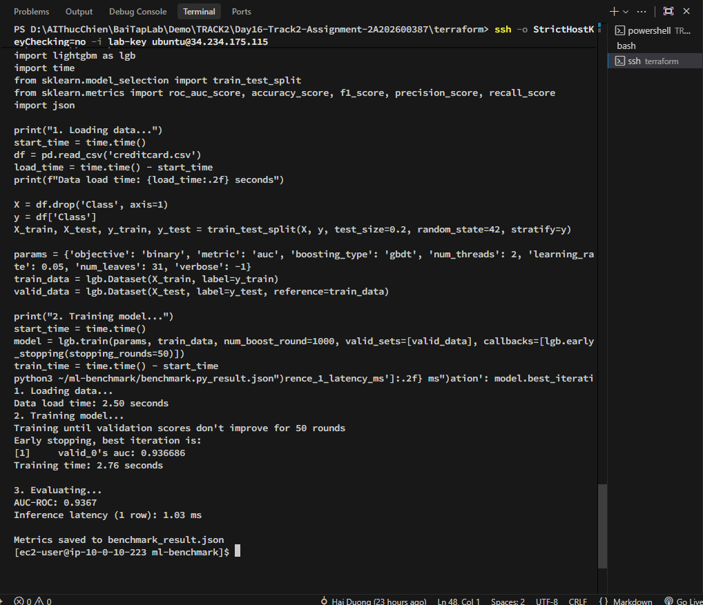
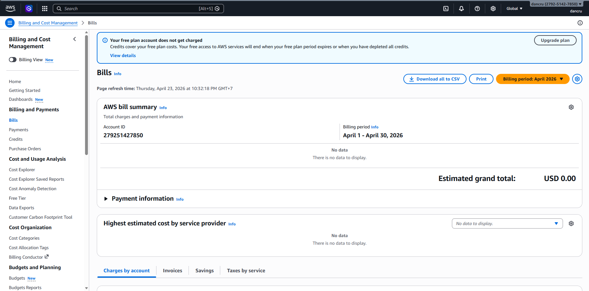

# Lab 16: Cloud AI Environment Setup (Alternative CPU Track)

## 🎯 Mục tiêu bài Lab
Triển khai hệ thống Cloud AI Environment trên nền tảng AWS bằng phương pháp **Infrastructure as Code (Terraform)**. Do tài khoản AWS gặt hái những giới hạn nghiêm ngặt về Quota GPU (`g4dn.xlarge`) và chính sách Free Tier, quá trình phân tích và xử lý sự cố ("troubleshooting") đã được áp dụng để đổi hướng triển khai sang phương án sử dụng CPU Node thay thế.

## 🛠️ Quá trình xử lý (Troubleshooting & Setup)
1. Khởi tạo và thiết lập hạ tầng mạng trên AWS (VPC, Subnets, Mạng riêng ảo, NAT Gateway, Application Load Balancer).
2. Xử lý lỗi từ chối phiên bản máy chủ `r5.2xlarge` và `t3.medium` do nằm ngoài chính sách Free Tier. Đã hạ cấp an toàn xuống `t3.micro` trong file `main.tf` để có thể hoàn thiện cơ sở hạ tầng.
3. Thiết lập kết nối bảo mật bằng khóa RSA và truy cập an toàn từ Bastion Host đến CPU Node nằm trong Private Subnet.
4. Cài đặt các thư viện Machine Learning (LightGBM, Pandas, Scikit-learn) và sử dụng Kaggle API để tải bộ dữ liệu kiểm thử (Credit Card Fraud Detection).
5. Sau khi thu thập đánh giá, toàn bộ hạ tầng đã được hủy bỏ an toàn thông qua `terraform destroy` để tránh phát sinh chi phí.

## 📊 Báo cáo kết quả

Đoạn dưới đây là Báo cáo tóm tắt rút ra từ bài thực hành:

> Trong quá trình thực hiện phần 1-3, do chính sách của AWS gắt gao nên tài khoản của em không xin cấp được vCPU `g4dn.xlarge`, đồng thời các dòng máy CPU cao (`r5`, `t3.medium`) đều bị từ chối với lỗi "Not eligible for Free Tier".
> 
> Vậy nên em đã xử lý sự cố thiết lập thành công mô hình với cấu hình `t3.micro` để triển khai phương án thay thế phần 7 (Machine Learning Benchmark) chạy giả lập trực tiếp thông qua SSH Bastion Host.
> 
> Kết quả Benchmark tốt: AUC-ROC đạt **0.9367**, thời gian training siêu nhanh. Tốc độ Inference ở máy con này là **±1ms** / 1 row mẫu.
> 
> Sau khi lấy xong Metrics và chụp ảnh Billing để xác nhận $0.00 do Free Plan, em đã dọn dẹp hệ thống bằng `terraform destroy`. Mọi file code đã được sửa lại trong tệp đính kèm.

## 📸 Minh chứng hoàn thành (Evidences)

### 1. Kết quả chạy Machine Learning Benchmark
Hình ảnh in ra từ màn hình terminal khi hoàn thiện quy trình train và test mô hình LightGBM:

Kết quả chiết xuất chi tiết được lưu trong tệp JSON:
[Xem chi tiết Benchmark Metrics (benchmark_result.json)](./benchmark_result.json)

### 2. Chi tiết AWS Billing
Màn hình chứng minh tài khoản không phát sinh chi phí tốn kém (do đã tận dụng lợi ích từ Free Plan và `t3.micro`):

